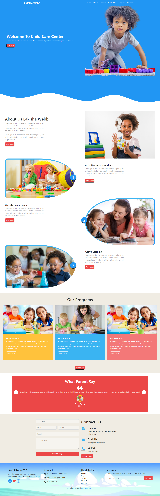

# CRUD Operation With PHP and MYSQL 
This is a simple web page made with HTML, CSS and Bootstrap.

## Authors

- [@Freecodextra](https://github.com/Freecodextra)

## 🚀 About Me
I'm a full stack developer. I'm good at front-end and back-end as well. I uses PHP and mySQL as back-end and vanilla JavaScript, and some JavaScript libraries and frameworks as front-end. working with couples. I'm hoping to land my first remote job very soon.
## Documentation

[Documentation](https://)

## Features

- Navigation Bar
- Figma to code
- Live previews
- Fullscreen mode
- Responsive Design 

## Screenshots

## Appendix
Kindly give me a star. I'm hoping to work with pros in PHP.

## Feedback

If you have any feedback, please reach out to us at freecodextra@gmail.com

## 🛠 Skills
Javascript, HTML, CSS, PHP, mySQL, jQuery, Bootstrap...

## Support

For support, email freecodextra@gmail.com

